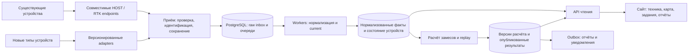

# Архитектура сайта Korovki для расширения

> Актуально на 2 октября 2026: серверные данные и очереди работают в PostgreSQL, задания планшета также хранятся в PostgreSQL. Для новых замесов основной расчёт выполняется онлайн на базе прежнего `module-3/telemetryProcessor.js`; завершение и чтение не заменяют сохранённые факты постобработкой. Фактический статус выпуска описан в [MIGRATION-STATUS.md](./MIGRATION-STATUS.md), эксплуатация — в [OPERATIONS.md](./OPERATIONS.md), проверка realtime — в [LOCAL-REALTIME-20261001.md](./LOCAL-REALTIME-20261001.md). Ниже сохранён первоначальный проект масштабирования; часть его этапов уже выполнена.

**Уточнение выбора БД:** после вопроса пользователя об отдельных базах для хозяйств см. [DATABASE-ISOLATION.md](./DATABASE-ISOLATION.md). Для дальнейшего проектирования рекомендована отдельная PostgreSQL database на хозяйство при общем домене и коде. Описанный ниже вариант общих бизнес-таблиц с farmId — первоначальная альтернатива, не обязательная схема.

12 сентября 2026. Основной документ после уточнения пользователя. План миграции данных и список несовместимостей остаются в [PLAN.md](./PLAN.md); его первоначальные сроки относятся только к переносу БД. Ниже — более широкий объём серверных работ. По просьбе пользователя локальный сайт обновлён fast-forward до origin/main `ae052d1`; создана отдельная ветка `refactor/server-platform-postgres`. Все дальнейшие изменения перехода делать в ней.

## Границы

Raspberry Pi, её код, настройки и локальный буфер не меняем. Существующие URL, форматы входящих пакетов, batch protocol v1, ACK и поведение при повторной отправке сохраняем. Сервер принимает HOST/RTK через durable PostgreSQL inbox; планшет получает current и ведёт подписанный журнал шагов. Realtime-слой меняет только серверный расчёт замесов и представление результатов.

Цель: сайт продолжает принимать данные при длительных вычислениях, подключение новых устройств не смешивает чужие измерения, изменения функций не требуют переделывать весь конвейер, сбой обработчика не уничтожает принятые данные. Абсолютную гарантию отсутствия сбоев дать нельзя; нужны измеримые границы нагрузки и проверенное восстановление.

## Предлагаемое устройство

Один репозиторий и модульное серверное приложение с отдельными запускаемыми процессами: HTTP API, обработчики телеметрии, расчёт/replay, фоновые задания. Основное хранилище — PostgreSQL 18. Роли процессов явно выбираются при запуске. Они могут первоначально работать на одной машине, но API можно масштабировать отдельно от вычислений.

ACK отправляется после записи в durable inbox, а не после расчёта замеса. Воркеры получают принятые события из очереди; raw, нормализованные факты и производные расчёты имеют разные роли. Бизнес-ошибка у одного пакета переводит его в диагностическое состояние, не останавливая всё хозяйство. Ошибка БД возвращает retryable ответ без ложного ACK.

## Что найдено в актуальном origin/main=ae052d1

| Наблюдение | Последствие при росте | Изменение |
|---|---|---|
| index.js запускает API, ingress workers и все schedulers вместе | Вторая копия API запустит ещё и вторые фоновые процессы | Отдельные entrypoints/roles; единственное выполнение job через DB lease |
| TelemetryWriteCoordinator — process-local mutex | Синхронизация действует только внутри одного процесса | Координация по БД и ключу обрабатываемой техники |
| module-3 экспортирует singleton TelemetryProcessor с deviceStates Map; routes содержат дополнительные Map | При рестарте/двух workers состояние отличается | Версионированный checkpoint и восстанавливаемое детерминированное ядро |
| findFreshRtkPoint в telemetry-helpers.js после промаха по deviceId ищет последний RTK без device-фильтра | Данные нового погрузчика могут повлиять на чужой HOST | Явные связи оборудования с периодом действия; никакого глобального fallback в новом пути |
| В HOST, RTK, FSM и dashboard есть fallback host_01 | Неидентифицированные устройства могут смешаться | Legacy mapping для существующего источника, обязательная идентичность для новых |
| Нет моделей Farm/Device/Asset, настройки общие | Добавление оборудования требует условностей; невозможно надёжно изолировать хозяйства | Реестр, принадлежность и типизированная конфигурация |
| Четыре SQLite-хранилища, часть таблиц создаётся вне Prisma | Нет общего управления схемой и атомарности между хранилищами | Одна мигрируемая PG-схема с явными таблицами |
| HOST processing и replay содержат отдельную оркестрацию расчёта | Исправление может попасть только в live или только в историю | Общее расчётное ядро и сравнение live/replay на одинаковом входе |
| Raw приём HOST/RTK не требует device credential на уровне приложения; RTK parser допускает до 50 MB | Посторонний/сломанный источник может засорить данные и занять RAM/CPU/диск | Контроль новых устройств, ограничения по маршруту/источнику, карантин и квоты |
| Dashboard использует polling latest/history/zones, одна главная HOST-метка | Рост числа клиентов повторяет выборки; интерфейс не является диспетчером парка | Реестр/список техники, выборка current по парку, дельты и дозагрузка истории |
| Day replay endpoint допускает до 100000 строк; RTK replay index целиком в памяти | Длительные ответы и расход RAM растут с историей | Серверная агрегация трека, курсоры, лимиты по диапазону и фоновые экспорты |

Это кодовые риски, не утверждение о новых авариях на production. Лимиты запросов, proxy и защита на реальном сервере в этом аудите не проверены.

## Модули и границы ответственности

- **Устройства и техника:** Farm, Asset (машина), Device (физический датчик/контроллер), DeviceBinding с validFrom/validTo, тип/возможности, статус и настройки. Один Asset может иметь несколько датчиков; замена датчика не создаёт новую машину и не меняет старую историю.
- **Приём и протоколы:** adapters legacy-host-v1, legacy-rtk-v1 и новые версионированные adapters. Преобразуют только формат, а не рассчитывают кормление. Общая оболочка события: внутренний eventId, farmId, deviceId, assetId, sourceStreamId/sourcePacketId при наличии, occurredAt, receivedAt, schemaVersion, adapterVersion, raw/hash, validation status.
- **Факты телеметрии:** типизированные поля веса/GPS/качества/питания и оригинальный raw отдельно. Не превращать все бизнес-таблицы в бесструктурный JSON. Для будущего сенсора добавляется adapter и его предметная проекция; существующий HOST-код не должен знать его формат.
- **Кормление:** состояние загрузки/выгрузки, замесы, компоненты, отклонения. Ядро принимает предыдущее состояние + событие + версии справочников, возвращает новое состояние и изменения. Оно не импортирует Express и не отправляет письма.
- **Задания погрузчика:** команды, revisions, идемпотентные события, управление терминалами; собственные права и атомарные переходы.
- **Справочники:** рационы, зоны, группы и настройки с версиями/датой действия. Пересчёт прошлого должен явно выбирать: исторические настройки или намеренно новую версию. Старые уже перезаписанные настройки нельзя восстановить задним числом; для legacy истории нужна отмеченная базовая версия.
- **Отчёты/уведомления:** отдельные jobs, доставка через transactional outbox. Бизнес-результат и намерение отправки записываются одной транзакцией. Отправка допускает повтор и требует дедупликации; внешнюю доставку нельзя обещать exactly-once.
- **Доступ и аудит:** пользователи, membership в хозяйстве, роли, привязка терминалов; журнал ручных правок с actor и revision. farmId берётся из доверенной привязки источника/сессии, а не принимается без проверки из payload.

Пользователь подтвердил плановый масштаб: 2–3 хозяйства, 20 устройств и 20 одновременно работающих пользователей. В расчётах принято 20 устройств и 20 пользователей суммарно. Поэтому Farm и Membership, выбор доступного хозяйства в UI и серверная изоляция входят в базовый объём. Общие рационы/зоны нельзя случайно применять к соседнему хозяйству. Проверять изоляцию прав, запросов, отчётов, кеша и заданий сразу на трёх хозяйствах.

Legacy alias уникален внутри подтверждённого источника/хозяйства, а внутренний Device ID глобально уникален. Farm входит в domain unique keys и составные внешние ключи, предотвращающие связи между хозяйствами; event dedupe учитывает внутреннюю идентичность источника. Все поиски, агрегации, очистки и background jobs обязаны иметь scope. Прямой запрос чужого ID должен отвергаться, даже если UI его скрывает. PostgreSQL RLS рассмотреть как дополнительный слой после испытания работы tenant context с Prisma pool; он не заменяет прикладную проверку membership и composite FK.

## Упорядочивание и восстановление

Параллельность — между независимыми машинами/хозяйствами. Обработка одной машины имеет один действующий lease и монотонный fencing token: проснувшийся старый worker не может записать состояние после передачи работы новому. Транзакция фиксирует факт, checkpoint, курсор, результаты и статус обработки либо весь комплект откатывается. Обновление памяти публикуется после commit или восстанавливается из committed checkpoint при retry.

SKIP LOCKED можно использовать для раздачи задач, но нельзя выдавать два соседних stateful события одной машины двум workers и надеяться, что БД сохранит порядок. Связанные HOST/RTK требуют общей стратегии event-time: хранить связи, high-water marks и точный набор входных фактов расчёта. Существующие stream/packet IDs не менять; retries и дубли являются штатным режимом.

Развести «самые свежие измерения для карты» и «последовательно рассчитанное состояние замеса». Current может показывать свежий валидированный факт, пока история догоняется; API отдаёт timestamps и processing status, чтобы интерфейс не выдавал старый расчёт за новый. Старый backlog никогда не отматывает current назад. В первом PG-релизе сохранить действующие fences; удалять их только после проверки новой схемы порядка.

Пересчёт: выбрать замкнутый диапазон входов и версии справочников, вычислить новое поколение, проверить полноту/dirty version, короткой транзакцией опубликовать. Старое поколение доступно до публикации. Если пришли поздние данные, отметить новый диапазон dirty, не публиковать устаревший результат как окончательный. Замесы через полночь и смену устройства должны иметь весь необходимый контекст, а не обрываться по календарю.

Ручные комментарии и статусы хранить отдельно от пересоздаваемых расчётных строк, с устойчивой связью к бизнес-сущности. Публикация нового поколения не должна менять публичные ссылки или терять задания/комментарии; нужна стратегия сопоставления и явное отражение разделения/слияния замесов.

## Совместимость и идентичность без изменений Raspberry Pi

Старые endpoints и ответы остаются. Серверный реестр связывает наблюдаемые идентификаторы существующих устройств с одной записью техники и текущим хозяйством. Временная legacy-поддержка должна быть явной, а не универсальным default host_01.

Если два старых устройства присылают неразличимые IDs/пакеты через один endpoint, сервер не сможет достоверно различить их без дополнительного уже имеющегося признака. IP мобильного оператора не является надёжной идентичностью. Новое оборудование регистрируется с отдельным ID/ключом и корректным протоколом с самого начала. Для старого безключевого протокола можно ограничить объём/частоту/область данных и наблюдать аномалии; криптографически подтвердить его источник только серверным кодом нельзя. Это сохраняемый legacy-риск, не причина менять Pi в этой задаче.

Проверить реальные максимальные размеры и частоты старых запросов до ужесточения лимитов. Ошибки парсинга сохранять в ограниченный карантин с метаданными; не бесконечно принимать огромные тела и не удалять подтверждённые пакеты по умолчанию. CORS с credentials и origin:true заменить списком фактических origins сайта; это не замена device authentication.

## Сайт и добавление функций

Начать с разделения API-клиента, состояния страницы, карты, техники и replay на модули. Для current — компактный ответ по выбранным assetIds; для истории — курсор и серверное прореживание по масштабу/времени, raw доступен отдельно администратору. Обновления — сначала инкрементальный polling, SSE добавить при доказанном выигрыше и с восстановлением по cursor после разрыва. Тяжёлые отчёты — асинхронный job с готовым результатом, а не длинный HTTP запрос.

Сохраняем Node.js/Express. Новый серверный код и контракты разумно писать на TypeScript постепенно: единые типы событий, runtime validation на границе и тесты. Смена языка backend или полная замена frontend не являются условием надёжности; каждую такую работу оправдывать конкретной проблемой.

## Нагрузка, резервирование и наблюдаемость

Подтверждённые частоты: существующий HOST отправляет один пакет в секунду; планшет запрашивает текущее состояние через сервер дважды в секунду. Планируется чтение серверной current-проекции, без синхронного вызова Raspberry Pi на каждый HTTP-запрос. Два соседних ответа могут содержать один и тот же пакет: 2 HTTP чтения/с не создают 2 новых измерения/с. Отдавать source timestamp, receivedAt, packet identity, age и quality; планшет определяет свежесть измерения, а не свежесть HTTP-ответа. Использование настоящего request/reply к Pi или двух новых измерений/с выходит за текущую границу «Pi не менять» и требует отдельного решения.

Для верхней стартовой модели считать до 20 HOST-подобных потоков по 1 Гц (20 пакетов/с) и до 20 планшетов по 2 Гц (40 current-запросов/с), плюс RTK, прочие действия пользователей и офлайн-досылка. Здесь 20 планшетов — консервативный профиль клиентов в рамках 20 одновременных пользователей; если это отдельные от пользователей терминалы, их нагрузка складывается. Частота RTK ещё не измерена, она не включена в 20 HOST-пакетов/с. Отдельный стресс-профиль 200 HOST-пакетов/с и 400 current-чтений/с проверяет десятикратный запас этих двух потоков, не является обещанием производительности без теста.

Current endpoint не должен сканировать raw-историю, запускать replay или строить длинный трек. Нужен один индексированный поиск по farm/asset либо проверенный кеш. При отсутствии связи с Pi отвечать последним значением с признаком stale/offline; нельзя просто обновлять timestamp старого веса. Для подтверждения загрузки на планшете сохранить требование свежего валидного измерения и соответствия выбранной машине.

Согласованный ориентир стенда — 3 хозяйства, 20 устройств и 20 одновременных пользователей суммарно. Это плановый объём, а гарантированная ёмкость устанавливается испытанием. Измерять пакеты/с и байты/с по типам, burst после офлайна, длительность хранения, worst-case replay и частоту операций пользователей. Проверить неравномерное распределение: одно хозяйство выгружает сутки backlog, два остальных продолжают live. Нужны квоты и справедливое обслуживание по хозяйству и устройству.

Проверять обычный поток + выгрузку 24 часов буфера + дневной replay + просмотр карты/отчёта одновременно. Отдельно 10x реального штатного пика, медленный диск, потерю соединения с PG, принудительное завершение worker, дубли и поздние пакеты. Устройство с большим backlog не должно лишать остальные обслуживания: справедливые очереди по устройствам, отдельные бюджеты live/history/replay.

На одной машине задавать лимиты ресурсов расчётного процесса и размеры DB pools; иначе отдельные процессы всё равно могут исчерпать общий CPU, RAM или connections. Базовая конфигурация 4 vCPU/8 GB — только отправная точка измерений. При двадцати устройствах поток 1 пакет/с круглосуточно — около 631 млн событий/год; срок raw-хранения и объём диска надо считать, а не обещать запас на фиксированных 100 GB.

Метрики из PLAN.md дополнить worker heartbeat, lag по каждому asset, срок lease, DLQ growth, последнюю успешную обработку, failed outbox и версию опубликованного расчёта. Разделить liveness API, readiness для приёма и состояние pipelines. Нынешний `/api/health` может вернуть status=ok при ошибке статистики inbox; одна зелёная проверка SELECT 1 не доказывает рабочую обработку.

Backup вне VPS и восстановление обязательны с первого PG-релиза. Высокая доступность при потере машины — отдельное решение: managed PG с failover либо реплика на другом узле и проверенная процедура переключения. Выбор зависит от допустимого простоя и бюджета. Реплика не заменяет backup от ошибочного удаления.

## Этапы и критерии завершения

| Этап | Результат | Приёмка |
|---|---|---|
| 0. Базовый стенд и контракт | Свежий полный snapshot, серверные ресурсы, эталон запросов/ответов и расчёта | Все типы данных учтены; baseline replay и API воспроизводятся |
| 1. PostgreSQL и миграции | Main + loader + AppState в PG, согласованные backups, SQLite inbox временно сохранены | Полная сверка, timezone/ID/терминалы, измерен cutover, проверен restore |
| 2. Границы модулей и процессы | API отдельно от workers/scheduler, durable jobs, retry/lease | API продолжает принимать при падении worker; одна job не исполняется одновременно дважды |
| 3. Реестр устройств и PG inbox | Три хозяйства, memberships, явные связи, legacy adapters, нормализация, все серверные очереди в PG | HOST/RTK не смешиваются; одинаковые legacy aliases корректно привязаны; чужие объекты недоступны; существующий Pi без изменений |
| 4. Общее расчётное ядро | Checkpoints, версии настроек, атомарная публикация replay | Live/replay совпадают на эталоне; fault/restart не меняет результаты; ручные данные сохранены |
| 5. Интерфейс парка и нагрузка | Работа с несколькими машинами, bounded history, async reports | Заданные SLO выполняются одновременно с backlog/replay на выбранном масштабе |
| 6. Эксплуатационная готовность | CI, миграции с совместимостью, runbooks, alerts и restore drills | Проверены релиз, остановка, откат до открытия записей и сценарий восстановления после |

Этапы должны иметь небольшие отдельные изменения и проходить сначала на копии. Не совмещать замену алгоритмов веса/GPS с переносом формата хранения. Добавить CI с проверкой типов, контрактами, unit ядра и интеграционными тестами на настоящем PostgreSQL; отдельный набор проверяет старый HTTP-протокол. В просмотренном origin/main `.github` workflows не найдено; наличие внешнего CI неизвестно.

Серверный рефакторинг под эту цель ориентировочно 4–7 недель одного разработчика с этапами проверки, при доступном production-снимке и фиксированном объёме функций. Это предварительный диапазон, не срок обязательства; полная реконструкция исторических настроек, расширенный UI, HA и неизвестные дефекты увеличат его. Первый полезный PG-релиз возможен раньше общего завершения. Оценка уточняется после этапа 0 и проектирования модели устройств.

## Что требуется перед реализацией

Актуальный доступ к серверу с подтверждённым SSH ключом; срок raw-хранения; допустимые простой и потеря данных; инвентаризация существующих идентификаторов HOST/RTK. Плановый масштаб подтверждён: до трёх хозяйств, 20 устройств и 20 пользователей суммарно. До замеров ёмкость и нагрузочные критерии остаются предварительными.

Локальный код сайта обновлён из GitHub без собственных функциональных правок. Raspberry Pi не менялась. Созданы проектные документы; commit/push/deploy не выполнялись. Практическое испытание новой архитектуры пока не проведено.
